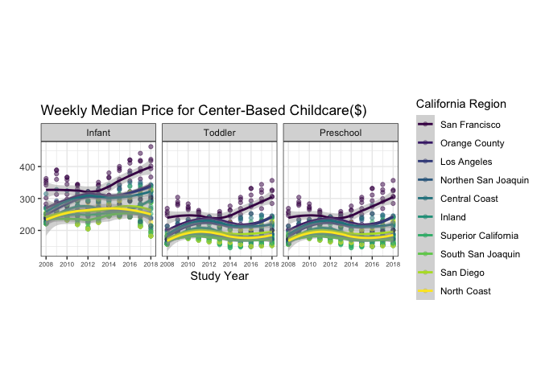

# Lab 6: Childcare Costs in California
Alondra Casas

# Part One: Set-up

In this lab, we will be using the **tidyr** and **forcats** packages to
explore the cost of childcare across the US. **You are expected to use
functions from tidyr and forcats to do your data manipulation!**

<!-- See instructions for words of advice on completing the assignment! -->

# Exploring Childcare Costs

## The Data

In this lab we’re going look at the median weekly cost of childcare in
California. The data come to us from
[TidyTuesday](https://github.com/rfordatascience/tidytuesday). A
detailed description of the data can be found
[here](https://github.com/rfordatascience/tidytuesday/blob/master/data/2023/2023-05-09/readme.md).
**You will need to use this data dictionary to complete the lab!**

We also have information from the California State Controller on tax
revenue for california counties from 2005 - 2018. I compiled the data
from [this
website](https://counties.bythenumbers.sco.ca.gov/#!/year/default) for
you. Note that there is no data for San Franscisco County. The variables
included in the `ca_tax_revenue.csv` data file (loaded below) include:

- `entity_name`: County name
- `year`: fiscal year
- `total_property_taxes`: total revenue in \$ from property taxes
- `sales_and_use_taxes`: total revenue in \$ from sales and use taxes

**0. Load the appropriate libraries and the data.**

``` r
library("tidyverse")
```

    ── Attaching core tidyverse packages ──────────────────────── tidyverse 2.0.0 ──
    ✔ dplyr     1.1.4     ✔ readr     2.1.6
    ✔ forcats   1.0.1     ✔ stringr   1.6.0
    ✔ ggplot2   4.0.1     ✔ tibble    3.3.1
    ✔ lubridate 1.9.4     ✔ tidyr     1.3.2
    ✔ purrr     1.2.1     
    ── Conflicts ────────────────────────────────────────── tidyverse_conflicts() ──
    ✖ dplyr::filter() masks stats::filter()
    ✖ dplyr::lag()    masks stats::lag()
    ℹ Use the conflicted package (<http://conflicted.r-lib.org/>) to force all conflicts to become errors

``` r
library(forcats)
```

``` r
childcare_costs <- read_csv('https://raw.githubusercontent.com/rfordatascience/tidytuesday/master/data/2023/2023-05-09/childcare_costs.csv')
```

    Rows: 34567 Columns: 61
    ── Column specification ────────────────────────────────────────────────────────
    Delimiter: ","
    dbl (61): county_fips_code, study_year, unr_16, funr_16, munr_16, unr_20to64...

    ℹ Use `spec()` to retrieve the full column specification for this data.
    ℹ Specify the column types or set `show_col_types = FALSE` to quiet this message.

``` r
counties <- read_csv('https://raw.githubusercontent.com/rfordatascience/tidytuesday/master/data/2023/2023-05-09/counties.csv')
```

    Rows: 3144 Columns: 4
    ── Column specification ────────────────────────────────────────────────────────
    Delimiter: ","
    chr (3): county_name, state_name, state_abbreviation
    dbl (1): county_fips_code

    ℹ Use `spec()` to retrieve the full column specification for this data.
    ℹ Specify the column types or set `show_col_types = FALSE` to quiet this message.

``` r
tax_rev <- read_csv('https://raw.githubusercontent.com/statistical-computing-r/spring-2026/refs/heads/main/labs/instructions/data/ca_tax_revenue.csv')
```

    Rows: 798 Columns: 4
    ── Column specification ────────────────────────────────────────────────────────
    Delimiter: ","
    chr (1): entity_name
    dbl (3): year, total_property_taxes, sales_and_use_taxes

    ℹ Use `spec()` to retrieve the full column specification for this data.
    ℹ Specify the column types or set `show_col_types = FALSE` to quiet this message.

**1. Briefly describe the `childcare_costs` dataset (~ 4 sentences).
What information does it contain?**

##### The childcare costs dataset contains information about the country, year, and proportions for a lot of factors such as race and population. Some of the columns have confusing names so it’s a little hard to decipher what they mean but I think they are all proportional values for different hosuehold factors. It also has a lot of different columns, with a lot of them containing zeros. I also thougt it was interesting how the countries were labeled by code.

## California Childcare Costs

**2. Let’s start by focusing only on California. Create a `ca_childcare`
dataset of childcare costs in California, containing (1) county
information and (2) all information from the `childcare_costs` dataset.
You should do all of this within one pipeline.**

``` r
ca_childcare <- 
  counties |>
  filter(state_name == "California") |>
  inner_join(childcare_costs)
```

    Joining with `by = join_by(county_fips_code)`

<!-- Checkpoint: There are 58 counties in CA and 11 years in the dataset. Therefore, your new dataset should have 53 x 11 = 638 observations. -->

**3. Now, lets add the tax revenue information to the `ca_childcare`
dataset. Add the data from `tax_rev` for the counties and years that are
already in the `ca_childcare` data. Overwrite the old `ca_childcare`
data with this dataset.**

``` r
ca_tax <- ca_childcare |>
  left_join(tax_rev, by = join_by(county_name == entity_name,
                                  study_year == year))
```

<!-- Checkpoint: You are only adding columns here, so your new dataset should still have 638 observations! -->

**4. Using a function from the `forcats` package, complete the code
below to create a new variable where each county is categorized into one
of the [ten (10) Census regions](https://census.ca.gov/regions/) in
California. Use the Region description (from the plot), not the Region
number.** The code below will help you get started.

``` r
superior_counties <- c("Butte","Colusa","El Dorado",
                       "Glenn","Lassen","Modoc",
                       "Nevada","Placer","Plumas",
                       "Sacramento","Shasta","Sierra","Siskiyou",
                       "Sutter","Tehama","Yolo","Yuba")

north_coast_counties <- c("Del Norte","Humboldt","Lake",
                          "Mendocino","Napa","Sonoma","Trinity")

san_fran_counties <- c("Alameda","Contra Costa","Marin",
                       "San Francisco","San Mateo","Santa Clara",
                       "Solano")

n_san_joaquin_counties <- c("Alpine","Amador","Calaveras","Madera",
                            "Mariposa","Merced","Mono","San Joaquin",
                            "Stanislaus","Tuolumne")

central_coast_counties <- c("Monterey","San Benito","San Luis Obispo",
                            "Santa Barbara","Santa Cruz","Ventura")

s_san_joaquin_counties <- c("Fresno","Inyo","Kern","Kings","Tulare")

inland_counties <- c("Riverside","San Bernardino")

la_county <- "Los Angeles"

orange_county  <- "Orange"

san_diego_imperial_counties <- c("Imperial","San Diego")
```

``` r
# Finish this code using the census regions defined above

ca_childcare <- ca_childcare |> 
  mutate(county_name = str_remove(county_name, " County")) |>
    mutate(region = fct_collapse(county_name,
    'Superior California' = c("Butte", "Colusa", "El Dorado","Glenn","Lassen","Modoc",
                       "Nevada","Placer","Plumas",
                       "Sacramento","Shasta","Sierra","Siskiyou",
                       "Sutter","Tehama","Yolo","Yuba"),
    'North Coast' = c("Del Norte","Humboldt","Lake",
                          "Mendocino","Napa","Sonoma","Trinity"),
    'San Francisco' = c("Alameda","Contra Costa","Marin",
                       "San Francisco","San Mateo","Santa Clara",
                       "Solano"),
    'Northen San Joaquin' = c("Alpine","Amador","Calaveras","Madera",
                            "Mariposa","Merced","Mono","San Joaquin",
                            "Stanislaus","Tuolumne"),
    'Central Coast' = c("Monterey","San Benito","San Luis Obispo",
                            "Santa Barbara","Santa Cruz","Ventura"),
    'South San Joaquin' = c("Fresno","Inyo","Kern","Kings","Tulare"),
    'Inland' = c("Riverside","San Bernardino"),
    'Los Angeles' = "Los Angeles",
    'Orange County' = "Orange",
    'San Diego' = c("Imperial","San Diego")
    
  ))
```

<!-- Tip: I have provided you with code that eliminates the word "County" from each of the county names in your `ca_childcare` dataset. You should keep this line of code and pipe into the rest of your data manipulations. -->

**5. Let’s consider the median household income of each region, and how
that income has changed over time. Create a table with ten rows, one for
each region, and two columns, one for 2008 and one for 2018 (plus a
column for region). The cells should contain the `median()` of the
median household income (expressed in 2018 dollars) of the `region` and
the `study_year`. Order the rows by 2018 values from highest income to
lowest income.**

<!-- Tip: This will require transforming your data! Sketch out what you want the data to look like before you begin to code. You should be starting with your California dataset that contains the regions! -->

``` r
ca_childcare |>
  filter(study_year %in% c(2008, 2018)) |> 
  group_by(region, study_year) |>
  summarise(medianincome = median(mhi_2018, na.rm = TRUE), .groups = "drop") |>
      pivot_wider(names_from = study_year, values_from = medianincome) |>
        arrange(desc('2018'))
```

    # A tibble: 10 × 3
       region              `2008`  `2018`
       <fct>                <dbl>   <dbl>
     1 San Francisco       90412. 104552 
     2 Northen San Joaquin 59108.  57769 
     3 Superior California 57831.  53270 
     4 North Coast         47862.  45528 
     5 South San Joaquin   52676.  52479 
     6 San Diego           58201.  60344.
     7 Los Angeles         63471.  64251 
     8 Central Coast       72979   74849 
     9 Orange County       86452.  85398 
    10 Inland              65977.  62056 

**6. Which California `region` had the lowest `median` full-time median
weekly price for center-based childcare for infants in 2018? Does this
`region` correspond to the `region` with the lowest `median` income in
2018 that you found in Q4?**

``` r
ca_childcare |>
  filter(study_year == 2018) |>
  group_by(region) |> 
  summarise(infant_care = median(mc_infant, na.rm = TRUE)) |>
  arrange(infant_care) |>
  slice(1)
```

    # A tibble: 1 × 2
      region              infant_care
      <fct>                     <dbl>
    1 Superior California        215.

<!-- Checkpoint: The code should give me the EXACT answer. This means having the code output the exact row(s) and variable(s) necessary for providing the solution. -->

**7. The plot in the instructions shows, for all ten regions, the change
over time of the full-time median price for center-based childcare for
infants, toddlers, and preschoolers. Recreate the plot. You do not have
to replicate the exact colors or theme, but your plot should have the
same content, including the order of the facets and legend,
reader-friendly labels, axes breaks, and a loess smoother.**

<!-- See instructions for hints on recreating the plot! -->

``` r
ca_childcare |>
  pivot_longer(
    cols = c(mc_infant,mc_toddler,mc_preschool), 
    names_to = "agetype", values_to = "medianincome") |>  
  mutate(agetype = str_to_title(str_remove(agetype, "mc_")) ,
         agetype = fct_relevel(agetype, "Infant", "Toddler", "Preschool"),
         region = fct_reorder2(region, study_year, medianincome)
  ) |>
  ggplot(aes(x = study_year, 
                   y = medianincome,
                   color = region)) +
  geom_point(alpha = 0.5) +
  geom_smooth(method = "loess", se = TRUE) +
  facet_wrap(~ agetype) +
  labs(x = "Study Year", y = " ", 
       title = "Weekly Median Price for Center-Based Childcare($)" , color = "California Region") +
  scale_x_continuous(breaks = seq(2008,2018, by = 2)) +
  theme_bw() + 
theme(aspect.ratio = 1, 
      axis.text.x = element_text(size = 6)) + 
  scale_color_viridis_d()
```

    `geom_smooth()` using formula = 'y ~ x'


